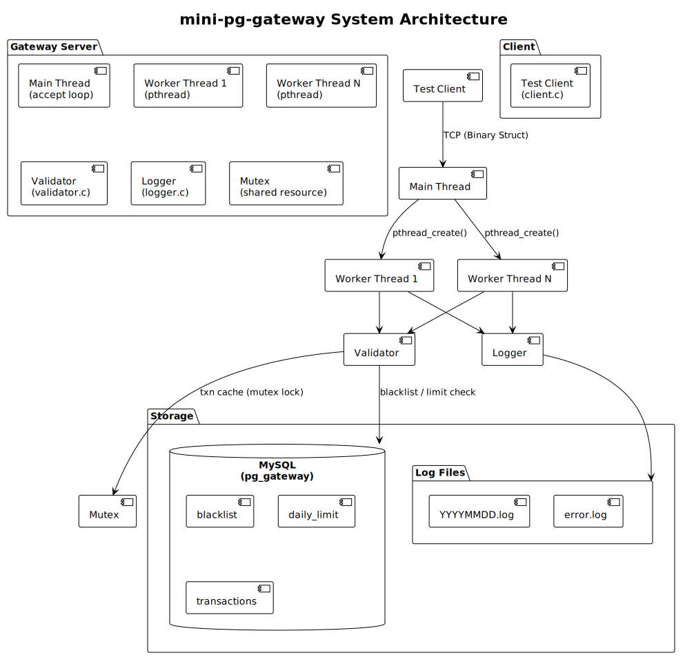
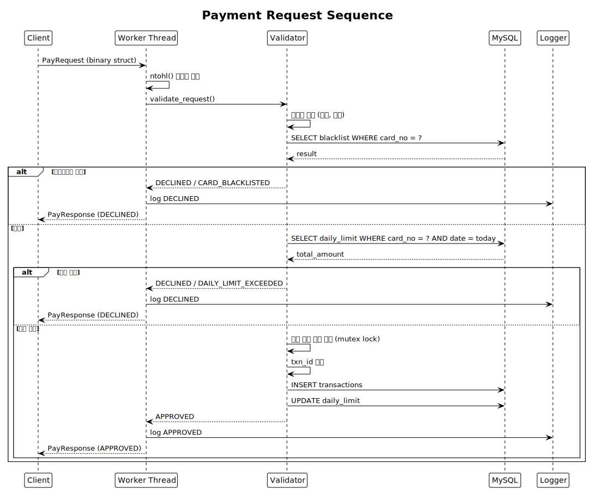
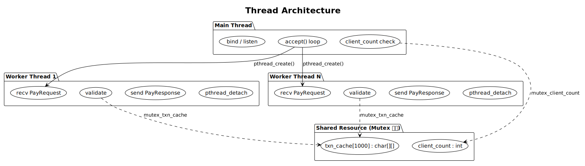

# mini-pg-gateway

C언어(C99)로 구현한 TCP 기반 결제 처리 시뮬레이터입니다. 실제 PG(Payment Gateway)사의 핵심 구조 — 소켓 서버, 멀티스레드 처리, MySQL 연동, 카드 검증 — 를 순수 C로 재현한 포트폴리오 프로젝트입니다.

---

## 시스템 아키텍처



---

## 결제 시퀀스



---

## 스레드 구조



---

## 사용 라이브러리

| 라이브러리 | 헤더 | 용도 | 선택 근거 |
|-----------|------|------|----------|
| pthread | `<pthread.h>` | 멀티스레드, 뮤텍스 | POSIX 표준, Linux 기본 내장 |
| libmysqlclient | `<mysql/mysql.h>` | MySQL DB 연동 | MySQL 공식 C API, 안정성 검증 |
| arpa/inet | `<arpa/inet.h>` | 엔디안 변환 (htonl/ntohl) | 네트워크 바이트 오더 POSIX 표준 |
| sys/socket | `<sys/socket.h>` | TCP 소켓 | POSIX 표준 소켓 API |
| sys/time | `<sys/time.h>` | 소켓 타임아웃 (SO_RCVTIMEO) | POSIX 표준 |
| time | `<time.h>` | 타임스탬프, 날짜별 로그 | C 표준 라이브러리 |
| stdint | `<stdint.h>` | uint8_t, uint32_t 고정 크기 타입 | C99 표준, 바이너리 프로토콜 필수 |

---

## 빌드 및 실행 방법

```bash
# 전체 빌드 + 실행 (Docker)
docker-compose up --build -d

# 서버 로그 확인
docker-compose logs -f gateway

# 클라이언트 테스트 (호스트에서)
gcc -o client client/client.c && ./client

# 종료
docker-compose down

# 완전 초기화 (DB 볼륨 포함)
docker-compose down -v
```

---

## 결제 검증 로직

5단계 순서로 검증하며, 하나라도 실패 시 즉시 DECLINED 응답을 반환합니다.

1. **입력값 검증** — 카드번호 형식(`xxxx-xxxx-xxxx-xxxx`), 금액 범위(1원~5천만원), 가맹점 ID 유효성, msg_type 허용값 확인
2. **블랙리스트 조회** — MySQL `blacklist` 테이블에서 카드번호 확인, 존재 시 `CARD_BLACKLISTED`
3. **일일 한도 조회** — 오늘 누적 결제액 + 요청 금액 > 1천만원 시 `DAILY_LIMIT_EXCEEDED`
4. **중복 거래 방지** — `client_ref_id`를 메모리 캐시(1000개)에서 조회, 중복 시 `DUPLICATE_TRANSACTION`
5. **승인 처리** — `TXN-{timestamp}-{6자리난수}` 형식의 거래 ID 생성 후 DB INSERT, 응답 전송

---

## 보안 설계

- **카드번호 마스킹**: `1234-5678-9012-3456` → `1234-****-****-3456` 형태로 로그 기록 및 DB 저장
- **입력값 검증**: 정규식 수준의 형식 검사로 비정상 입력 차단
- **버퍼 오버플로우 방지**: 모든 문자열 복사에 `strncpy` 사용 + 마지막 바이트 `\0` 명시적 처리
- **스레드 안전**: 공유 자원(접속 수 카운터, 캐시 배열)은 `pthread_mutex_t`로 보호

---

## 로그 구조

```
log/
├── 20260615.log    # 날짜별 거래 로그
└── error.log       # 에러 로그 (누적)
```

**거래 로그** (`YYYYMMDD.log`):
```
[2026-06-15 14:32:01] APPROVED  TXN-1718425921-482910  1234-****-****-3456  50000  MERCHANT_001
```

**에러 로그** (`error.log`):
```
[2026-06-15 14:32:05] ERROR  DB_CONNECTION_FAILED              mysql_real_connect() failed
```

---

## 향후 확장 계획

- **TLS/SSL 암호화**: `openssl` 연동으로 카드정보 전송 구간 암호화
- **관리자 모니터링 웹 UI**: Node.js + Express 기반 실시간 거래 현황 대시보드
